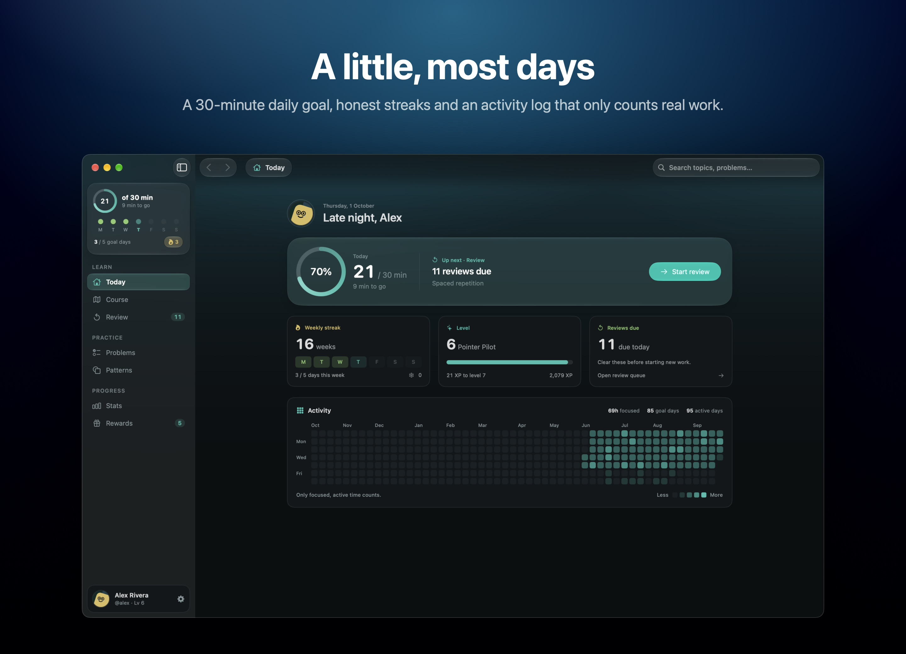
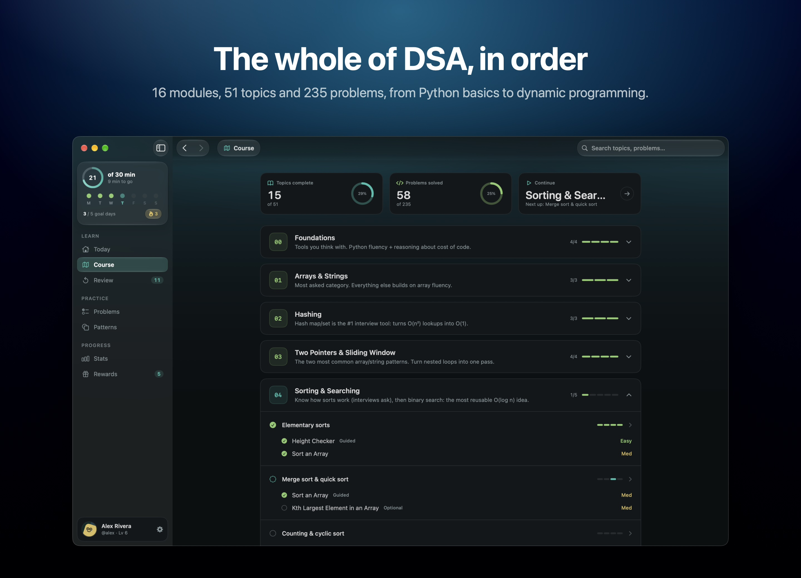
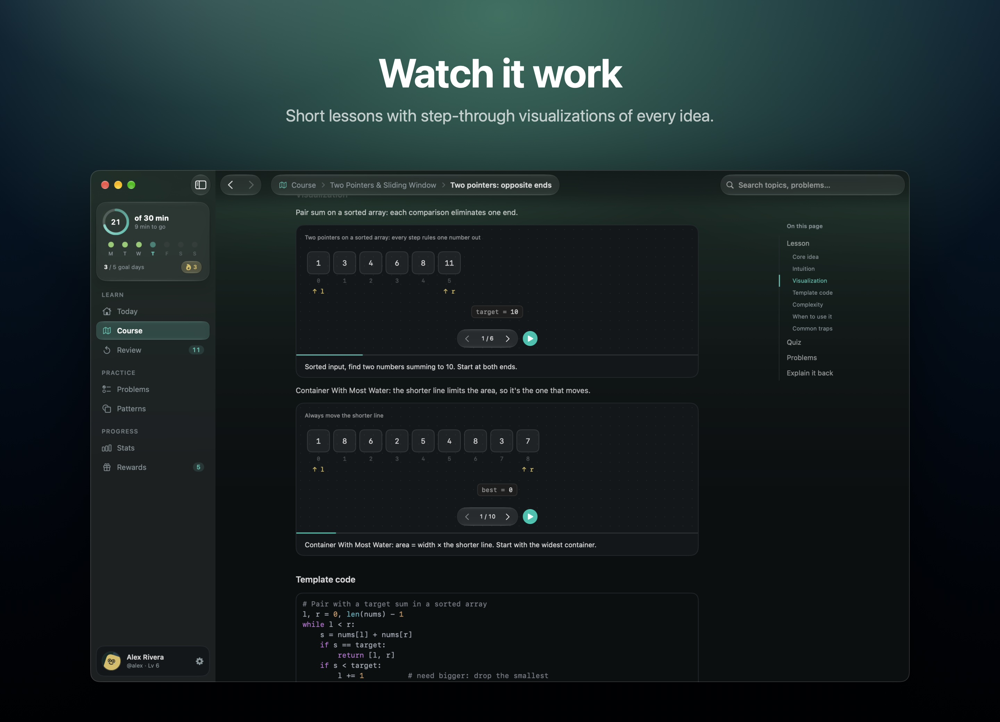
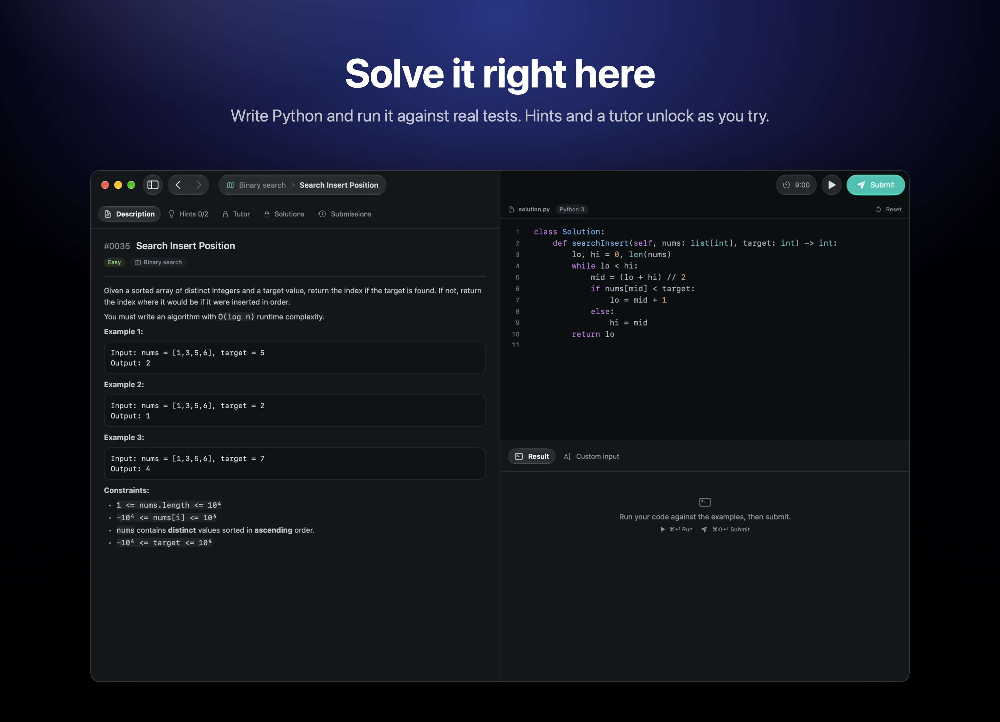
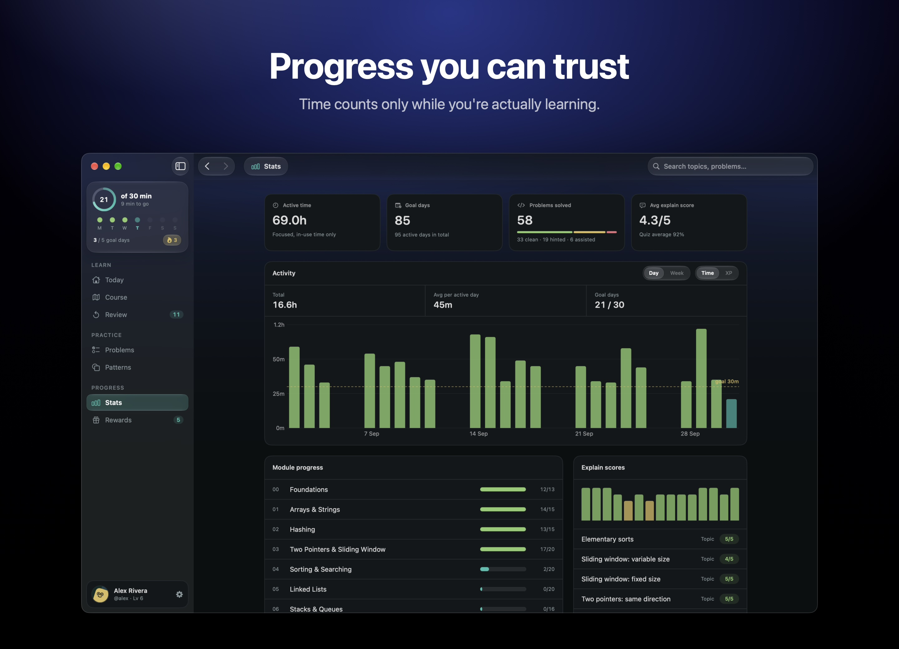
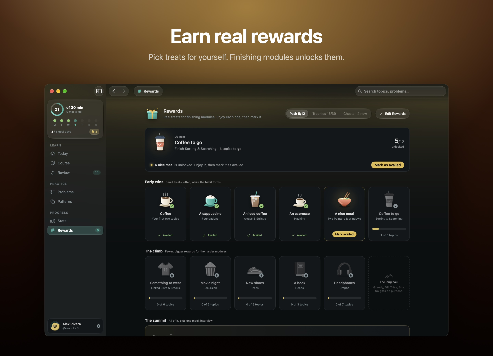

<p align="center">
  
</p>

<h1 align="center">Recurse</h1>

<p align="center">
  A Mac app for learning data structures and algorithms in Python, half an hour a day.
</p>

<p align="center">
  <a href="https://github.com/akdevv/recurse/releases/latest"></a>
  
  <a href="LICENSE"></a>
</p>

<p align="center">
  <a href="https://github.com/akdevv/recurse/releases/latest/download/Recurse.zip"><b>Download for Mac</b></a>
  &nbsp;·&nbsp;
  <a href="https://github.com/akdevv/recurse/releases">Releases</a>
</p>

<p align="center"></p>

I built Recurse because I kept starting DSA prep and dropping it a week later. Grinding random problems on a website never stuck for me. I wanted one app that told me what to learn next, made me actually write the code, and nagged me a little to come back tomorrow. Everything stays on your Mac. There's no account and no server.

> [!NOTE]
> It needs macOS 26 (Tahoe) or later on an Apple silicon Mac. The builds are arm64 only, so Intel Macs won't run it, even on macOS 26.
>
> The AI tutor and the feedback on your explanations are optional. They need either a Claude subscription with [Claude Code](https://claude.com/claude-code) installed, or your own Anthropic, OpenAI or Gemini API key. Everything else works without them.

## What you get

**A whole course.** 16 modules, 51 topics, 235 problems. It starts at Python basics and ends at graphs and dynamic programming. Each topic has a short lesson, visualizations you can step through, and a quiz.

**A judge in the app.** You write Python right there. Run checks your code against the examples. Submit runs the full generated test set, with time limits, so an O(n²) answer to an O(n) problem fails.

**Hints that don't give it away.** They unlock as you spend time on a problem. After the hints there's a tutor that asks you questions instead of handing you code. The full solution comes last.

**Reviews.** Problems you've solved come back on a spaced schedule. Each module ends with a boss fight: one timed problem, and then you explain your solution in your own words.

**Streaks that mean something.** Only active time counts, so leaving the app open doesn't help. Hit your daily goal to keep the day and week streaks going.

**Rewards.** XP, trophies and mystery chests. You can also set real treats for yourself, like a coffee or a game, that unlock when you finish a module.

**Mac stuff.** Liquid Glass, ⌘K search, a menu bar item, a widget and reminders.

<table>
  <tr>
    <td></td>
    <td></td>
  </tr>
  <tr>
    <td></td>
    <td></td>
  </tr>
</table>

<p align="center"></p>

## Install

1. [Download Recurse.zip](https://github.com/akdevv/recurse/releases/latest/download/Recurse.zip), unzip it and drag Recurse.app into Applications.
2. Open it. I haven't notarized the app, so macOS will say it can't verify the developer. Go to **System Settings › Privacy & Security**, scroll down and click **Open Anyway**. You only have to do this once.
3. The judge runs your code with `python3`. If macOS asks to install the Command Line Tools, say yes.

The AI parts (feedback on your explanations, and the tutor) are optional. They work with your Claude subscription through the [`claude` CLI](https://claude.com/claude-code), or with your own Anthropic, OpenAI or Gemini API key. Pick one in **Settings › AI**. The rest of the app works fine without any of it.

### Updating

Use **Recurse › Check for Updates…**, or download the new release and replace the app. Your progress is saved in `~/Library/Application Support/Recurse`, not inside the app, so updates don't touch it.

Moving to a new Mac? Export from **Settings › Data** and import the file on the other machine.

## Building it yourself

You'll need Xcode 26 (Swift 6.2) and an Apple silicon Mac.

```sh
cd mac
swift run            # debug build
./build-app.sh       # release build in build/Recurse.app
swift test
```

[`mac/CLAUDE.md`](mac/CLAUDE.md) explains how the app is put together, and [`courses/CLAUDE.md`](courses/CLAUDE.md) documents the course file format.

```
mac/          the SwiftUI app, widget and tests
courses/dsa/  the course: modules → topics (lesson, quiz, viz) → problems
scripts/      content tooling, plus pyjudge.py, the judge the app runs
```

Recurse started as a web app. That version lives on the [`web-archive`](https://github.com/akdevv/recurse/tree/web-archive) branch.

## License

The code is [MIT](LICENSE). Problem statements are from LeetCode. Some solutions and explanations are from [doocs/leetcode](https://github.com/doocs/leetcode) under [CC BY-SA 4.0](https://creativecommons.org/licenses/by-sa/4.0/), and they stay under those terms.
