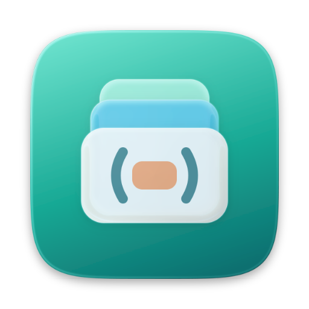

<p align="center">
  
</p>

<h1 align="center">Recurse</h1>

<p align="center">
  Learn data structures and algorithms in Python, one focused half hour a day.<br />
  A native Mac app. Local-first, no account.
</p>

<p align="center">
  <a href="https://github.com/akdevv/recurse/releases/latest/download/Recurse.zip"><b>Download for macOS</b></a>
  ·
  <a href="https://github.com/akdevv/recurse/releases">Releases</a>
</p>

<!-- Screenshot: Today. Add docs/screenshots/today.png and uncomment.
<p align="center"></p>
-->

## What's inside

- **A full course.** 16 modules, 51 topics and 235 problems, from Python basics to graphs and dynamic programming. Every topic has a short lesson, step-through visualizations and a quiz.
- **A built-in judge.** Write Python in the app. Run checks the examples, Submit runs every generated test, with time limits that catch slow solutions.
- **Help that makes you think first.** Hints unlock with time spent trying, then a Socratic tutor, then full solutions.
- **Learning that sticks.** Spaced reviews bring problems back before you forget them. Every module ends with a boss fight: one timed problem, then explain your solution.
- **Honest progress.** Only active time counts. A daily goal feeds your day and week streaks.
- **Rewards you pick.** XP, trophies and mystery chests, plus real treats you choose that unlock as you finish modules.
- **Feels at home on the Mac.** Liquid Glass, ⌘K search, a menu bar item, a widget and gentle reminders.

<!-- Screenshots: add images to docs/screenshots/ and uncomment.
<p align="center">
  
  
</p>
<p align="center">
  
  
</p>
-->

## Install

1. [Download **Recurse.zip**](https://github.com/akdevv/recurse/releases/latest/download/Recurse.zip), unzip it and drag **Recurse.app** into Applications.
2. Open it. macOS says it can't verify the developer, because the app isn't notarized. Open **System Settings › Privacy & Security**, scroll down and click **Open Anyway**. You only do this once.
3. Running code needs `python3`. If macOS offers to install the Command Line Tools, accept.

Requires macOS 26 or later. AI feedback on your explanations and the tutor use the [`claude` CLI](https://claude.com/claude-code), logged in. Everything else works without it.

### Updates and your data

Use **Recurse › Check for Updates…**, or download the new release and replace the app. Your progress is stored in `~/Library/Application Support/Recurse`, outside the app, so updating never touches it.

To move to another Mac, use **Settings › Data › Export** and import that file on the new one.

## Build from source

```sh
cd mac
swift run            # debug build
./build-app.sh       # build/Recurse.app
swift test
```

See [`mac/CLAUDE.md`](mac/CLAUDE.md) for the architecture and [`courses/CLAUDE.md`](courses/CLAUDE.md) for the course content format.

## Project layout

```
mac/          The SwiftUI app, widget and tests
courses/dsa/  The course: modules → topics (lesson, quiz, viz) → problems
scripts/      Content tooling and pyjudge.py, the Python judge the app runs
```

The original web version is archived on the [`web-archive`](https://github.com/akdevv/recurse/tree/web-archive) branch.

## License

The code is [MIT](LICENSE). Problem statements come from LeetCode, and some solutions and explanations come from [doocs/leetcode](https://github.com/doocs/leetcode) under [CC BY-SA 4.0](https://creativecommons.org/licenses/by-sa/4.0/). Those remain under their own terms.
